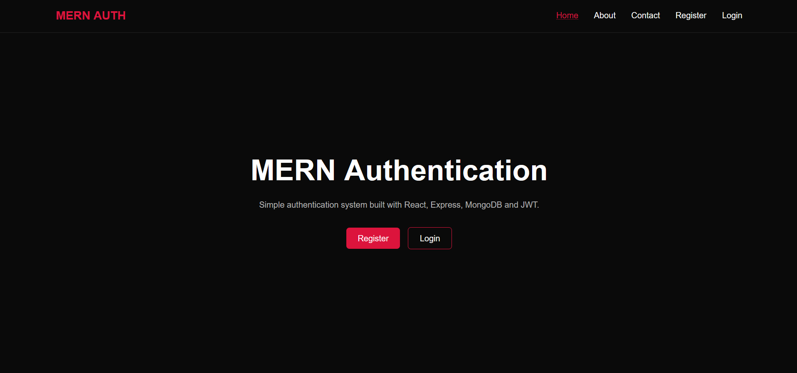

# MERN Authentication

A simple full-stack authentication project built with the MERN stack.

The project focuses only on the core authentication flow:

- User registration
- User login
- User logout
- JWT-based authentication
- Protected content for authenticated users
- Public Home, About, and Contact pages
- React Context API for authentication state
- HTTP-only cookie for storing the JWT

## Sneak Peek



## Tech Stack

### Frontend
- React
- React Router
- Context API
- Axios
- CSS

### Backend
- Node.js
- Express.js
- MongoDB
- Mongoose
- bcryptjs
- JSON Web Token (JWT)
- HTTP-only cookies

## Authentication Flow

1. A user registers with a username, email, and password.
2. The password is hashed using `bcryptjs`.
3. A JWT is generated after successful registration/login.
4. The JWT is stored in an HTTP-only cookie.
5. The frontend uses the Auth Context to keep track of the authenticated user.
6. Protected routes are accessible only when the user is authenticated.
7. Logout clears the authentication cookie and removes the user from the frontend state.

## Project Structure

```text
MERN-Authentication/
├── client/
│   ├── src/
│   │   ├── components/
│   │   ├── context/
│   │   ├── pages/
│   │   └── api/
│   └── ...
│
├── server/
│   ├── controllers/
│   ├── middleware/
│   ├── models/
│   ├── routes/
│   └── ...
│
└── README.md
```

## Environment Variables

### Server

Create a `.env` file inside the server directory:

```env
PORT=5000
MONGO_URI=your_mongodb_connection_string
JWT_SECRET_TOKEN=your_jwt_secret
NODE_ENV=development
```

## Running the Project

### Backend

```bash
cd server
npm install
npm run dev
```

### Frontend

Open another terminal:

```bash
cd client
npm install
npm run dev
```

The frontend and backend should then run on their respective local development ports.

## API Routes

| Method | Route | Description |
|---|---|---|
| POST | `/api/auth/register` | Register a new user |
| POST | `/api/auth/login` | Login an existing user |
| POST | `/api/auth/logout` | Logout the current user |
| GET | `/api/auth` | Check authentication / get current user |

## Notes

This project is intentionally kept simple and focuses on understanding how authentication works across a React frontend and Express backend using JWT and cookies.
